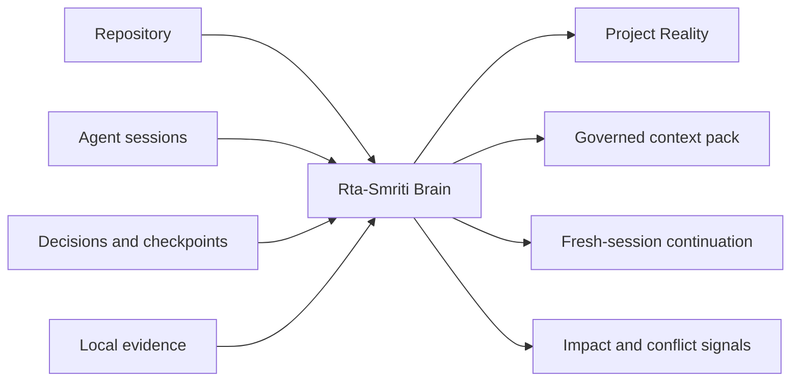
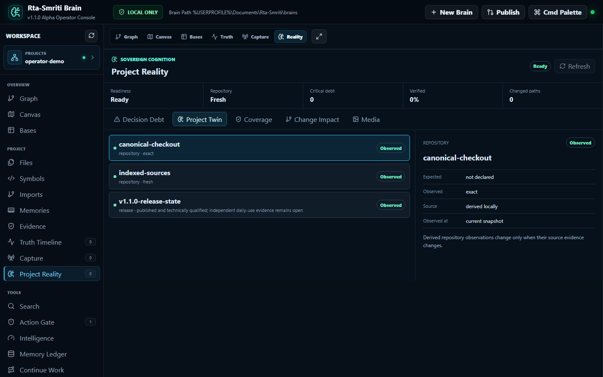
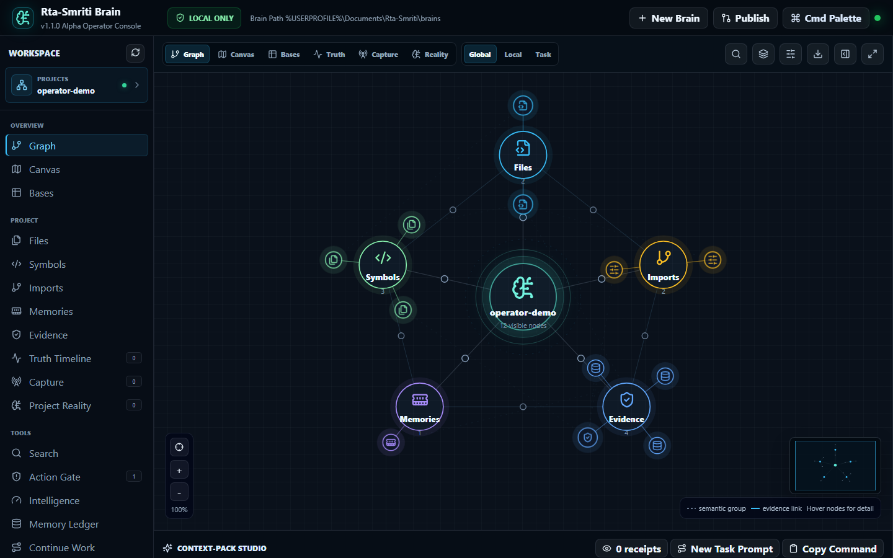
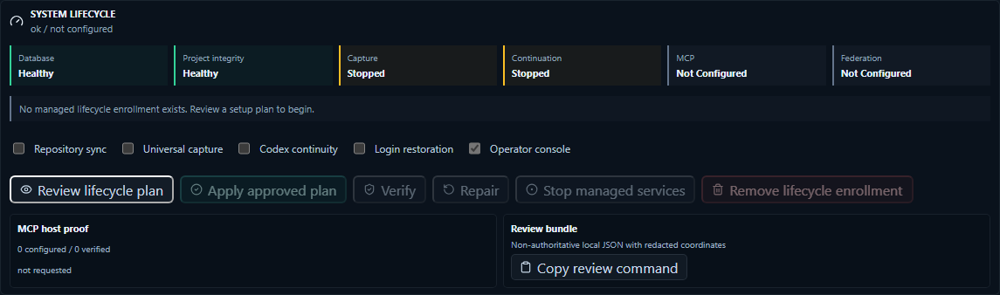
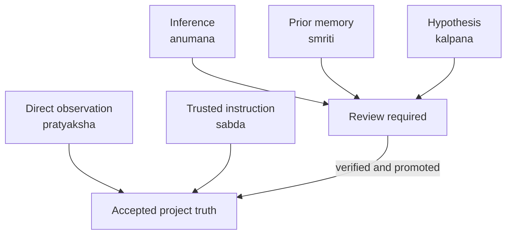
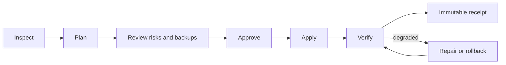
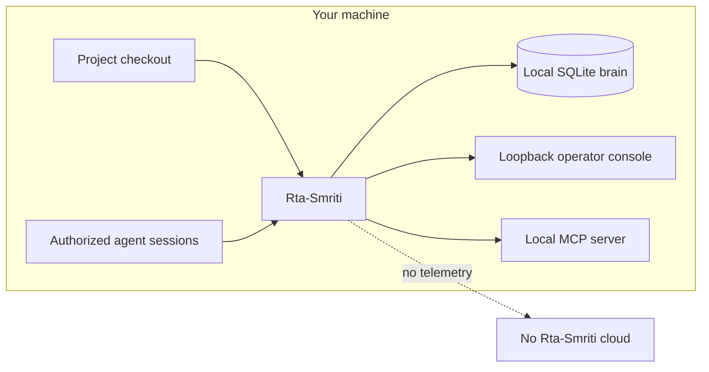
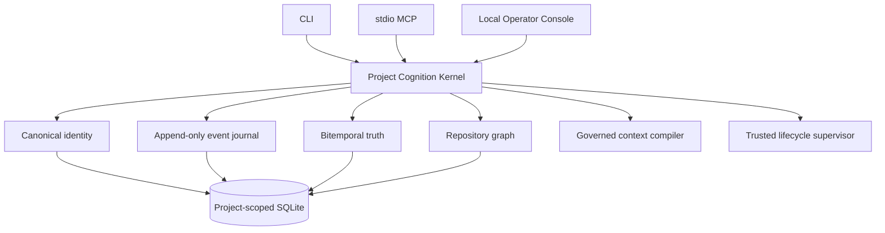

# Rta-Smriti Brain

**A sovereign, local project-memory and evidence layer for AI coding agents.**

## About this fork

This is [kapptech88](https://github.com/kapptech88)'s fork of
[sulabhdubey/rta-smriti-brain](https://github.com/sulabhdubey/rta-smriti-brain), kept so that
[Kapp's Dev Planner Bundle](https://github.com/kapptech88/kapp-dev-planner-bundle) has a pinned,
tested memory backend. Upstream does the hard part: a sovereign SQLite "brain" per project that
stores repository structure, decisions, checkpoints, and evidence with provenance labels
(`pratyaksha` observed, `sabda` stated, `anumana` inferred), plus a stdio MCP server so any agent
can read that memory without re-telling the project's story every session.

What this fork is for:

- **Planning workflow backend.** The Dev Planner Bundle runs a project through drill-me → PRD →
  tasks → plan. Every user answer, stack decision, and milestone becomes a `remember` entry, and
  each step ends with a `checkpoint` that the next session picks up through `continue-prompt`.
- **Three hosts, one install.** Verified on Claude Code and Grok Build, wired for Cursor: a
  `python3 -m venv` install under `~/.local/share/rta-smriti`, CLI wrappers in `~/.local/bin`, and
  a read-only MCP gateway (`rta-brain-mcp --brain-dir …`) over all project brains. Writes go
  through the CLI so they stay explicit and visible.
- **Python 3.14 tested.** Upstream lists 3.11 to 3.13; this fork records that 3.14.7 works on Linux
  with the current dependency set and keeps the install script honest about it.
- **Machine-aware planning.** The bundle's `/drill-me` step can inventory the machine, assess how
  the installed toolchain fits the build, recommend a better stack, and store the observed
  versions in the brain as direct evidence.

Nothing here changes upstream's privacy posture: local SQLite, no telemetry, no cloud database,
one brain per project. Bug fixes that are not specific to the bundle are sent upstream.

Quick start with the bundle:

```bash
git clone https://github.com/kapptech88/kapp-dev-planner-bundle ~/Projects/kapp-dev-planner-bundle
cd ~/Projects/kapp-dev-planner-bundle
./install.sh --brain        # clones this fork into ~/.local/share/rta-smriti/src and installs it
./install.sh --host all     # Claude Code, Grok Build, Cursor
```

Then open a repo in a terminal-hosted agent and run `/drill-me`.

Credit: Rta-Smriti was conceived and researched by Sulabh Dubey and built with OpenAI Codex.
MIT licensed, as is this fork.

---

Rta-Smriti gives every project a durable memory: repository structure, agent sessions,
decisions, evidence, and the exact state needed to continue work without retelling the story.


[](https://github.com/sulabhdubey/rta-smriti-brain/actions/workflows/ci.yml)
[](https://github.com/sulabhdubey/rta-smriti-brain/actions/workflows/binaries.yml)
[](https://github.com/sulabhdubey/rta-smriti-brain/releases)
[](LICENSE)

[**Install**](#ten-minute-start) | [**Current release**](https://github.com/sulabhdubey/rta-smriti-brain/releases/tag/v1.1.0-alpha) | [**Live website**](https://sulabhdubey.github.io/rta-smriti-brain/) | [**Documentation**](#documentation) | [**Discussions**](https://github.com/sulabhdubey/rta-smriti-brain/discussions)

## v1.1.0-alpha

**Current release: v1.1.0-alpha.** Trusted lifecycle operation now sits beside Project
Reality, governed context, temporal truth, repository intelligence, and local capture.

> **Current maturity:** `v1.1.0-alpha` is an advanced early-adopter release for Windows,
> macOS, and Linux. It is useful for real projects, but it is not yet presented as a
> broadly supported production platform. Read the bounded
> [release verification record](docs/RELEASE_VERIFICATION.md).

## The Problem

Every new agent session begins with an expensive question: **what is true about this
project right now?** Repositories hold code, chats hold decisions, tools hold test
results, and people hold the constraints. Ordinary retrieval collapses them into text.

Rta-Smriti keeps them local, connected, time-aware, and evidence-labelled.



## What You Get

| Need | Rta-Smriti capability |
| --- | --- |
| Start a new agent task without retelling everything | Bounded context packs and structured continuation checkpoints |
| Know whether recalled context deserves trust | Evidence provenance, hashes, freshness, and `pramana` labels |
| Understand a repository beyond keyword search | Files, symbols, imports, calls, tests, memories, and evidence graph |
| Detect drift and contradiction | Canonical project identity, bitemporal truth, conflict and decision-debt views |
| Preserve long-running agent work | Incremental, redacted, resumable session capture and immutable event history |
| Operate local services without guesswork | Preview-confirmed lifecycle plans, independent health axes, repair, and receipts |
| Use multiple AI coding hosts | Local stdio MCP plus recipes for Codex, Claude Code, Cursor, Zed, OpenCode, and Gemini CLI |
| Keep project data private | Local SQLite, no telemetry, no cloud database, explicit capture grants |

## See The Product



<table>
  <tr>
    <td width="50%"></td>
    <td width="50%"></td>
  </tr>
  <tr>
    <td><strong>Inspectable project graph</strong><br />Navigate code, memories, evidence, and their relationships.</td>
    <td><strong>Trusted lifecycle</strong><br />Inspect, preview, apply, verify, repair, and retain a sealed receipt.</td>
  </tr>
</table>

The [60-second v1 product demo](launch-assets/product-hunt/rta-smriti-v1.0.2-product-demo.mp4)
was captured from `v1.0.2`. It demonstrates the Project Reality foundation; the
`v1.1` Trusted Lifecycle Supervisor shown above was added later.

## How It Works

### 1. Build a local project brain

Rta-Smriti indexes the canonical Git checkout into project-scoped SQLite. It records
content hashes, symbols, imports, evidence, temporal state, and durable memories without
uploading the project to a hosted service.

### 2. Separate evidence from memory



A test result, a human instruction, an inference, and a brainstorm are not treated as
the same kind of fact. Claims retain their source, verification state, and valid time.

### 3. Compile only the context the next task needs

The context compiler selects direct evidence before low-trust history, obeys explicit
token budgets and privacy grants, and emits a selection receipt explaining what was
included and why.

### 4. Operate through one trustworthy boundary



Database, repository, capture, continuation, MCP, and federation health remain
independent. A running process alone never proves that continuation is ready.

## Ten-Minute Start

**Requirements:** Python 3.11 or newer and Git. Node.js is needed only to modify the
dashboard or website source.

The **v1 Project Reality CLI** is the shared entry point for onboarding, search,
continuation, lifecycle operation, MCP configuration, and the local console.

### Windows PowerShell

```powershell
git clone https://github.com/sulabhdubey/rta-smriti-brain.git
cd .\rta-smriti-brain
python -m venv .venv
& .\.venv\Scripts\python.exe -m pip install .
$RtaBrain = Join-Path $PWD ".venv\Scripts\rta-brain.exe"
$BrainDir = "$env:USERPROFILE\Documents\Rta-Smriti\brains"
& $RtaBrain start C:\path\to\my-project --project my-project --brain-dir $BrainDir --write-agents
```

<details>
<summary><strong>macOS or Linux</strong></summary>

```bash
git clone https://github.com/sulabhdubey/rta-smriti-brain.git
cd rta-smriti-brain
python3 -m venv .venv
./.venv/bin/python -m pip install .
RtaBrain="$PWD/.venv/bin/rta-brain"
BrainDir="$HOME/.local/share/rta-smriti/brains"
"$RtaBrain" start /path/to/my-project --project my-project --brain-dir "$BrainDir" --write-agents
```

</details>

`start` detects the canonical Git root, creates or migrates the brain, indexes the
repository, starts managed sync, starts matching Codex continuity capture when local
sessions exist, and opens an authorized local console. Use `--no-continuity` on machines
without local Codex sessions.

Prefer a standalone binary? Download the Windows, macOS, or Linux artifact and its SBOM
from the [`v1.1.0-alpha` release](https://github.com/sulabhdubey/rta-smriti-brain/releases/tag/v1.1.0-alpha),
then verify it against `SHA256SUMS.txt`.

## Private By Default



- Capture is opt-in, source-scoped, bounded, and redacted before durable queuing.
- Captured text remains untrusted evidence until verified or promoted.
- The console binds to loopback and uses short-lived session capabilities.
- Project names, paths, transcript content, databases, keys, and snapshots must not be
  published. Public diagnostics use bounded counts and fingerprints.
- Signed or encrypted snapshots are private backup artifacts, not publication formats.

Read the complete [security and privacy policy](SECURITY.md) before handling sensitive
repositories. Report vulnerabilities through the private process documented there.

## Architecture At A Glance



Rta-Smriti is deliberately an evidence and continuity layer. It does **not** execute
project work, choose models, silently edit host configuration, or replace an agent
harness such as RTA-Net AI.

## Release Evidence

The current prerelease includes:

- cross-platform CI and native binaries for Windows, macOS, and Linux;
- CycloneDX SBOMs and a signed workflow provenance trail;
- anonymous-download checksum verification;
- installed-package, CLI, dashboard, lifecycle, MCP, privacy, and security checks;
- an explicit record of host recipes versus hosts exercised live.

Green tests are not presented as proof of universal correctness. Exact scope, known
limits, and remaining external-host gates are recorded in
[Release Verification](docs/RELEASE_VERIFICATION.md).

## Documentation

| Start here | What it covers |
| --- | --- |
| [Installation](docs/INSTALLATION.md) | Source install, native binaries, upgrades, troubleshooting, uninstall |
| [10-minute Atlas path](docs/ATLAS_10_MINUTE_PATH.md) | Small end-to-end trial on a synthetic project |
| [Usage guide](docs/USAGE_GUIDE.md) | CLI workflows, capture, checkpoints, context, snapshots, workspaces |
| [Architecture](docs/ARCHITECTURE.md) | Identity, event journal, truth model, graph, compiler, lifecycle |
| [MCP host matrix](docs/MCP_HOST_MATRIX.md) | Host recipes, capability profiles, and live-proof status |
| [Public benchmark](docs/PUBLIC_BENCHMARK.md) | Reproducible retrieval harness and honest interpretation |
| [Release notes](docs/RELEASE_NOTES_v1.1.0-alpha.md) | What changed in `v1.1.0-alpha` |
| [Release verification](docs/RELEASE_VERIFICATION.md) | Tests, artifacts, checksums, security evidence, and limits |
| [Contributing](CONTRIBUTING.md) | A practical first contribution path |
| [Roadmap](ROADMAP.md) | Planned product waves and boundaries |

## Community

### Share What Happened

Tried Rta-Smriti on a real project?

- [Share your experience](https://github.com/sulabhdubey/rta-smriti-brain/discussions)
- [Ask for installation help](https://github.com/sulabhdubey/rta-smriti-brain/discussions/categories/q-a)
- [Report a bug](https://github.com/sulabhdubey/rta-smriti-brain/issues/new?template=bug_report.yml)
- [Pick a first contribution](https://github.com/sulabhdubey/rta-smriti-brain/issues?q=is%3Aissue+is%3Aopen+label%3A%22good+first+issue%22)
- [Star the repository](https://github.com/sulabhdubey/rta-smriti-brain) if it saved you from repeating project context

Rta-Smriti was [featured on The Next New Thing](https://www.youtube.com/watch?v=AWzzmrCPe-A&t=1350s)
in its GitHub repository roundup.

## Provenance And License

Conceived and researched by [Sulabh Dubey](https://github.com/sulabhdubey).
Built with [OpenAI Codex](https://openai.com/codex/) as the primary design,
engineering, testing, and documentation agent under Sulabh's product direction and
release approval. See [Contributors](CONTRIBUTORS.md) for the full provenance statement.

Released under the [MIT License](LICENSE).
